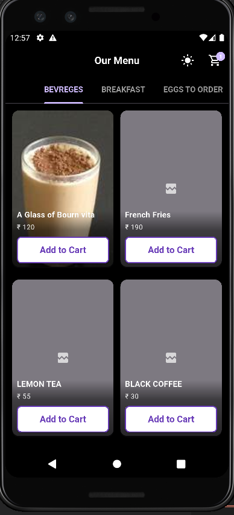
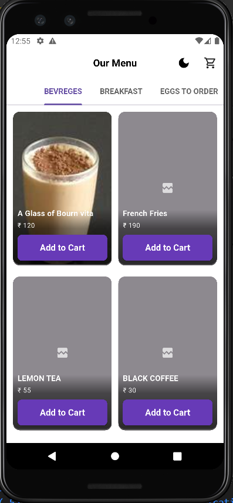
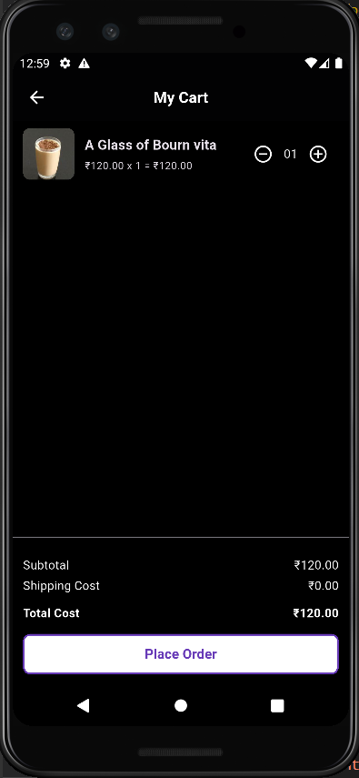
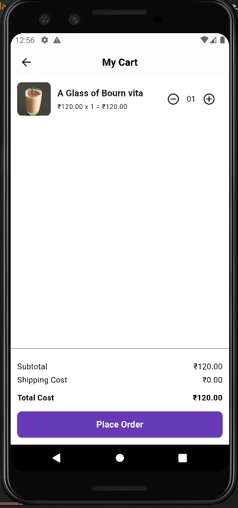

# Flutter Food Ordering App

A sleek and simple food ordering app built using Flutter. The app supports category-wise menus, cart functionality, local notifications for order confirmation, and dynamic light/dark theme switching.

---

##   Steps to Run the App

1. **Clone the repository**

   ```bash
   git clone https://github.com/your-username/food-ordering-app.git
   cd food-ordering-app
2. **Package	                        Purpose**
    get	                             State management and navigation
    flutter_local_notifications	     Local notifications for order placement
    cached_network_image	         Efficient image loading and caching
    shimmer	                         Shimmer effect for loading placeholders
    get_storage	                     Persistent theme storage   
    
3. **Screenshots**
    ### Menu Screen
    
    
    
    ### Cart Screen
    
    

    ### Shimmer Screen
    
    